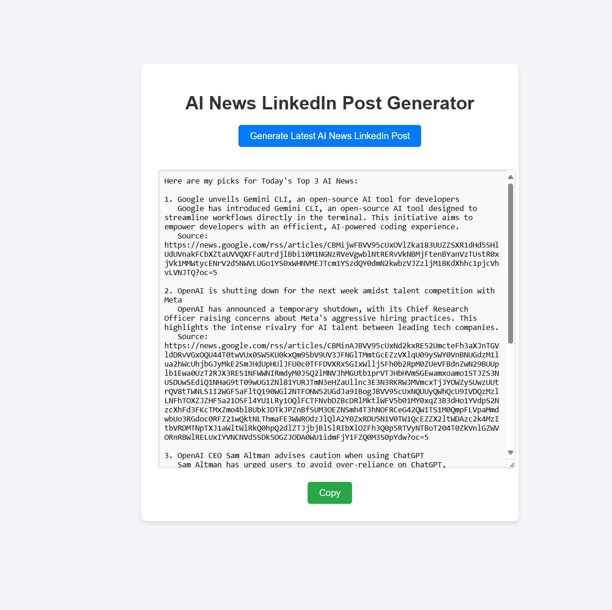
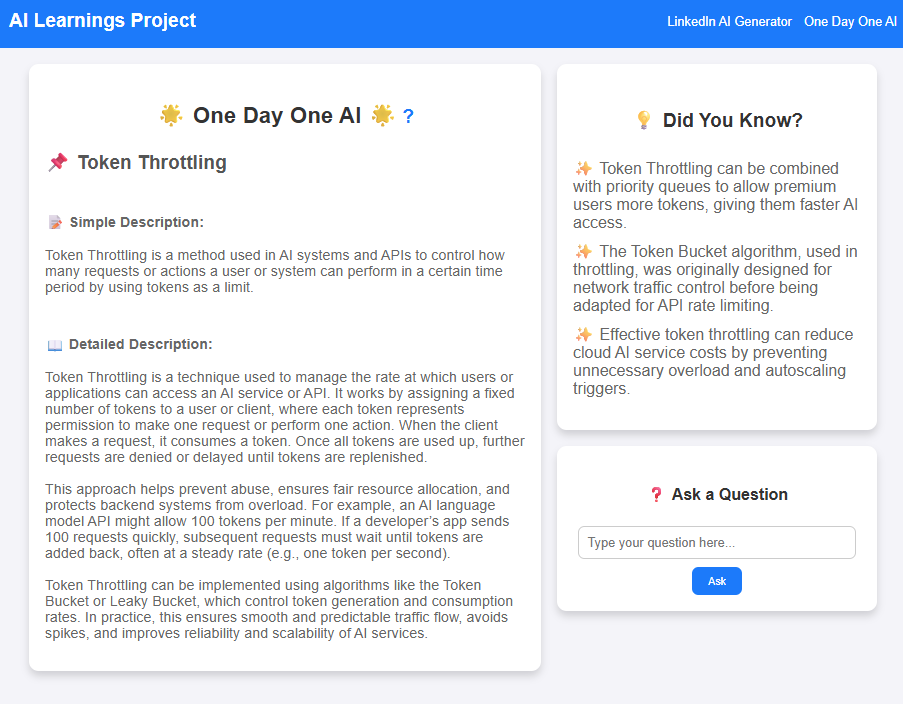

# AI Learnings Project

Welcome to the AI Learnings Project! This repository is designed to explore and share insights about artificial intelligence through engaging content and tools.

## Visual Overview

Here are some examples of what you can create with this project:




## Project Overview

This project consists of two main components:

### Backend
The backend provides services for generating AI-related posts, answering questions, and sharing daily AI insights. Key files include:
- `main.py`: Entry point for the Python backend.
- `models.py`: Contains data models for AI-related content.
- `prompts.py`: Handles AI-related prompts and queries.
- `aiTerms.json`: Stores AI-related terms and definitions.

### Frontend
The frontend offers an interactive user interface for selecting and generating AI posts. Key files include:
- `App.js`: Main application logic.
- `LinkedInAIGenerator.js`: Tool for creating LinkedIn-ready AI posts.
- `PostSelectionDialog.js`: Dialog for selecting AI post templates.

## Features
- **AI Post Generator**: Create engaging AI-related posts for social media.
- **Daily AI Insights**: Learn something new about AI every day.
- **Interactive UI**: Easily select and customize AI content.

## Getting Started

### Prerequisites
- python

### Installation
1. Clone the repository:
   ```bash
   git clone https://github.com/your-repo/AILearningsProject.git
   ```
2. Navigate to the project directory:
   ```bash
   cd AILearningsProject
   ```
3. Install dependencies for both backend and frontend:
   ```bash
   cd backend && npm install
   cd ../frontend && npm install
   ```

### Running the Project
1. Start the Python backend server:
   ```bash
   cd python-backend && python main.py
   ```
2. Start the frontend development server:
   ```bash
   cd frontend && npm start
   ```

3. Open your browser and navigate to `http://localhost:3000`.

## Contributing
We welcome contributions! Feel free to submit issues or pull requests to improve the project.

## License
This project is licensed under the MIT License.

## Contact
For questions or feedback, please reach out to [your-email@example.com](mailto:your-email@example.com).

