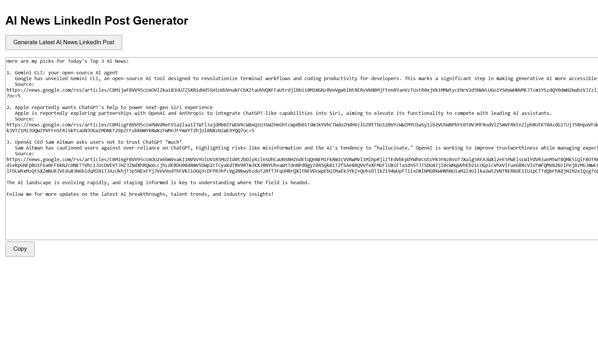

# NewsSummary Project

## Overview
Hi there! Welcome to NewsSummary, a project I’m really excited to share with you. It’s a web app designed to make staying informed easier and faster. With the help of Artificial Intelligence (AI) and Azure OpenAI services, NewsSummary takes long news articles and turns them into short, easy-to-read summaries. It’s perfect for anyone who wants to stay updated without spending hours reading.


## Demo Screenshot

Here’s a quick look at what NewsSummary looks like in action:



## Project Structure
```
backend/
    index.js
    package.json
frontend/
    package.json
    public/
        index.html
    src/
        App.js
        index.js
```

### Frontend
The frontend is built with React, so it’s fast, modern, and easy to use. You’ll find all the code for it in the `frontend/` folder. I’ve used `react-scripts` to keep the development process smooth and straightforward.

### Backend
The backend is where the magic happens. It’s in the `backend/` folder and connects to Azure OpenAI services. This is what powers the AI that processes and summarizes the news articles. It’s designed to be smart and reliable, so you get summaries you can trust.

## Installation
Getting started is super simple. Here’s what you need to do:

1. Clone the repository:
   ```bash
   git clone <repository-url>
   cd NewsSummary
   ```

2. Install the dependencies for both the frontend and backend:
   ```bash
   cd frontend
   npm install
   cd ../backend
   npm install
   ```

## Usage

### Running the Frontend
To get the frontend up and running, just type:
```bash
cd frontend
npm start
```

### Running the Backend
To start the backend and let the AI do its thing:
```bash
cd backend
node index.js
```

The backend will automatically connect to Azure OpenAI services to process the news articles and generate summaries.

## Build
When you’re ready to share the app with the world, you can create a production build of the frontend:
```bash
cd frontend
npm run build
```

## Contributing
I’d love to hear your ideas and suggestions! If you’d like to contribute, feel free to fork the repository and send a pull request. Let’s make NewsSummary even better together.

## License
This project is open-source and available under the MIT License. Feel free to use it, share it, and build on it. Enjoy!
